# Controls

## AppCenter
Represents the main container of other controls with navigation pane, action area, user control, search...

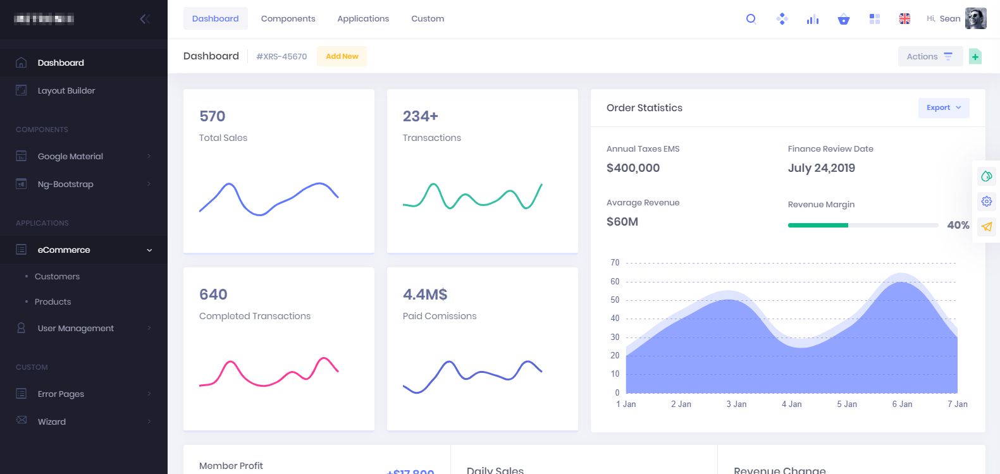

Allowed childs:
* `ActionArea`
* `NavigationPane`
* `UserCenter`
* `Search`

## ActionArea
Is the area that contains actions. Rendering depends by the parent control.

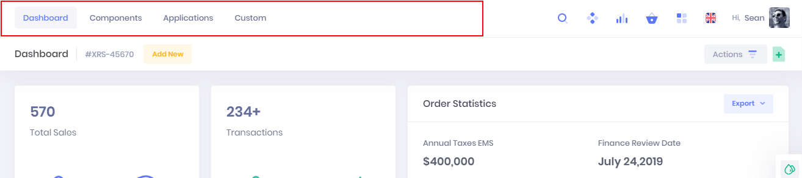

Allowed childs:
* `Action`

## ActionGroup
Group one or more actions with a title.

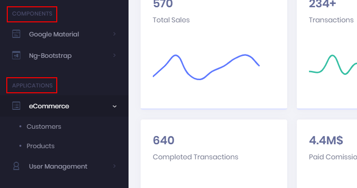

Available properties:
* `caption`

Allowed childs:
* `Action`

## ActionList
Similar to `ActionArea` but arranges actions in a list way with additional description.

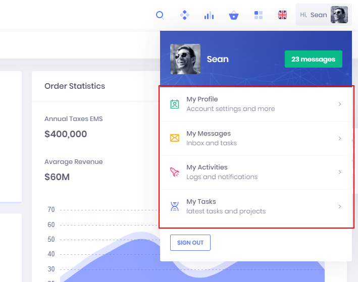

Allowed childs:
* `Action`

## Action
Represents an action clickable by user (menu item, button...)
Actions can be nested to generate menu trees.

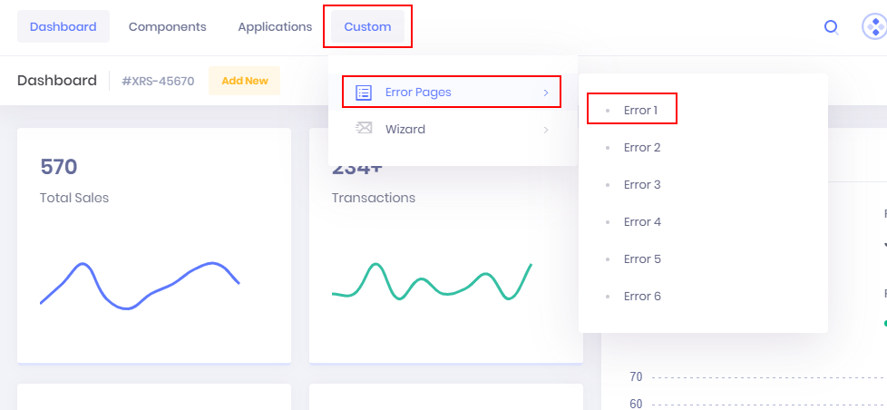

Available properties:
* `caption`
* `icon`
* `descripton` 
* `category` changes button appearance (predefined string value or custom)
  * `record` for data  actions (new, modify, delete, refresh...)
  * `process` for business actions (register, send, process...)
  * `related` for related information to main record (ex. from customer to shipping addresses)
  * `report` for reporting (PDF...)

Available methods:
* `click`

Allowed childs:
* `Action`

## Search
Available as `AppCenter` child, represents generic and free text search.

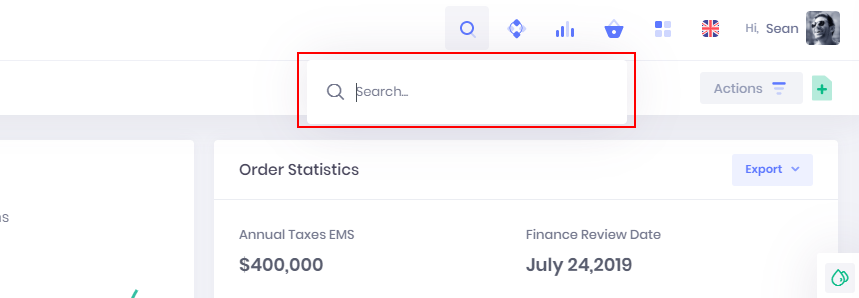

Available methods:
* `search(what)`

## NavigationPane
Available as `AppCenter` child, represents a menu navigation pane.

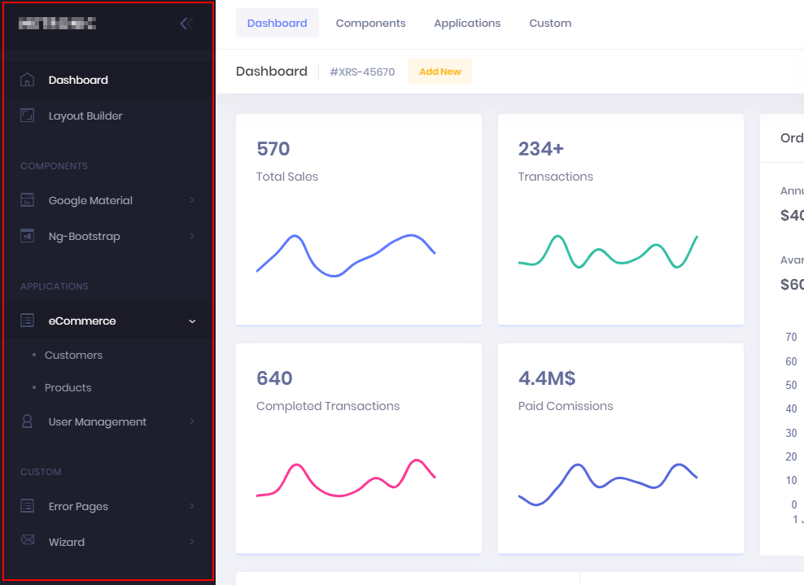

Allowed childs:
* `ActionGroup`
* `Action`

## UserCenter
Available as `AppCenter` child, represents the area dedicated to the logged in user with additional information, signout...

Allowed childs:
* `ActionList`
* `Action`

Available properties:
* `username`

## ContentArea
It's the root control of the child pages, normally rendered inside an `AppCenter`.

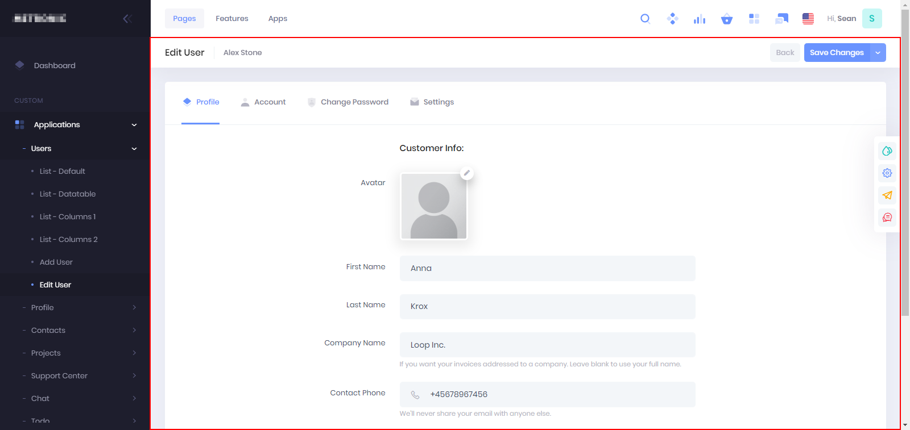

Allowed childs:
* `Repeater`
* `Group`
* `ActionArea`

## Group
Each page is organized with one or more collapsible group.

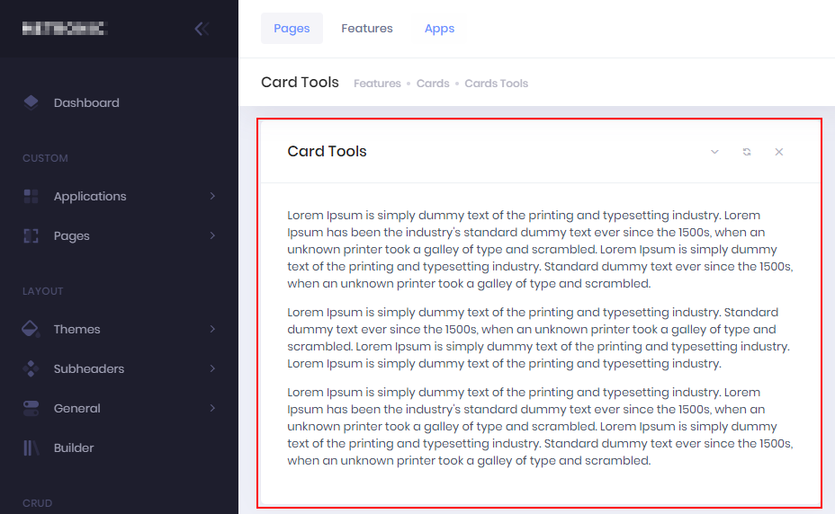

Allowed childs:
* `Field`

Available properties:
* `caption`

## Repeater
Represents a table of data.

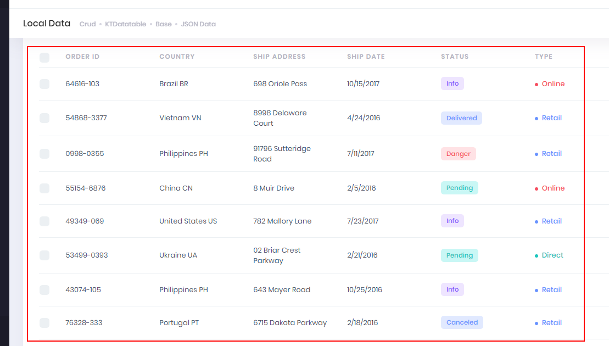

Allowed childs:
* `Field`

Available methods:
* `dblclick`

## Field
It's the simplest control that accepts data input. It's rendered differently according to field data type.

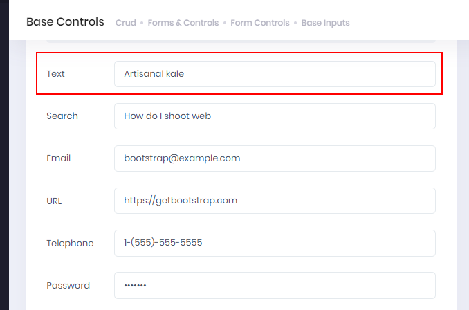

Available methods:
* `validate(value, parsevalue)` validate value in the field and writes it to the database; if "parsevalue" is true value is converted from string
* `getrelated(value)` get related values from tablerelation

Available properties:
* `caption`
* `codename`
* `controltype`
* `datatype`
* `hasrelations`