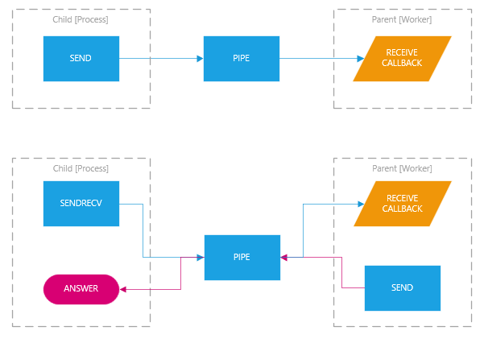

# Multiprocessing Architecture

## ProcessPool
`ProcessPool` class handle multiple workers spawned in a separate process.

Main `ProcessPool` is stored in `process_pool` variable of `Application` class. 
`Application.sessions` is a multiprocess dictionary shared between all processes.

`enqueue` method of `ProcessPool` search for an available worker and submit the
job to be processed. If no workers are available, the method will hold until one of
worker end previous job and a warning event is logged.

Each job must be submitted with these parameters:
* `control` instance of `ControlProxy` class
* `function` pointer to function to be executed
* variable arguments for the function

Each worker wait for a message coming on his pipe:
* `request` the function job is called and return value is send back into the 
pipe as `response` message
* `reload` tells `import` module to reload a specific file due changes

`enqueue` waits for `response` message or for the special `control` message that 
represents a callback for the parent.

## ControlProxy and Control
`ControlProxy` class is created by parent and has two members:
* `receive_callback` that is function passed by `enqueue` method
* `send` that allows parent to send a message to child

`Control` static class is created by child and has two members:
* `send` that send a message to parent invoking `ControlProxy.receive_callback`
* `receive` that receive a message from parent sent by `ControlProxy.send`

## Session lifecycle
After `ProcessPool` creates a new child, `Application` is initialized and all apps are loaded. If instance has a database a new connection is made.

At the beginning of the message loop `Session` is initialized; at the end database transaction is comitted.

## RPC request lifecycle
After a new RPC request arrives, a new `Session` is started passing to it an authentication token if available.

Authentication token can arrives via HTTP cookie `core-auth-token` or via HTTP header `X-Core-AuthToken`.

Start of `Session` calls if available the method  `start` of special object `app.codeunit.SessionManagement`.

After the handling of the request, `Session` is stopped and  if available the method  `stop` of special object `app.codeunit.SessionManagement` is called.

## Websocket request lifecycle
When a new websocket is opened `Session` is started and registered in a multiprocess shared memory area because will be served by any available process in the pool.

When a new message arrives from websocket `Session` state is loaded from shared memory. If the request is handled successful, `Session` state is updated in shared memory for future requests.

When the websocket is closed `Session` is stopped and its state unregistered from shared memory.

