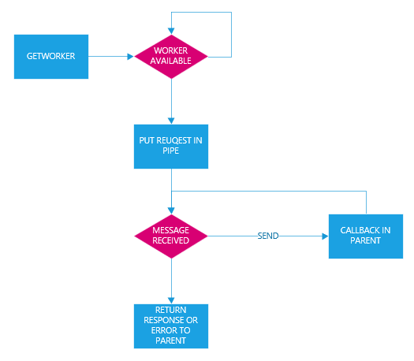

# Multiprocessing Architecture

## ProcessPool
`ProcessPool` class handle multiple workers spawned in a separate process.

Main `ProcessPool` is stored in `process_pool` variable of `Application` class. 

`getworker` method of `ProcessPool` search for an available worker or create one if permitted by maximum pool size. If no workers are available, the method will hold until one of
worker end previous job and a warning event is logged.

## Worker
Once a worker is obtained from `ProcessPool` is possible set some properties:
* `recv_callback` pointer to callback function (data coming from child for the parent)
* `keep_alive` to keep busy the worker also if response is sent back to parent (useful to keep session data in memory, for socket session)

Each job must be submitted via `request` method with these parameters:
* `function` pointer to function to be executed
* variable arguments for the function

Each child process wait for a message coming on his pipe:
* `request` the function job is called and return value is send back into the 
pipe as `response` message
* `reload` tells `import` module to reload a specific file due changes
* `error` if an error happens on the client side (for example client disconnected)

## Control
`Control` static class is created by child and has two members:
* `send` that send a message to parent 
* `sendrecv` that send a message to parent and wait for an answer

## Session lifecycle
After `ProcessPool` creates a new child, `Application` is initialized and all apps are loaded. If instance has a database a new connection is made.

At the beginning of the message loop `Session` is initialized; at the end database transaction is comitted.

## RPC request lifecycle
After a new RPC request arrives, a new `Session` is started passing to it an authentication token if available.

Authentication token can arrives via HTTP cookie `core-auth-token` or via HTTP header `X-Core-AuthToken`.

Start of `Session` calls if available the method  `start` of special object `app.codeunit.SessionManagement`.

After the handling of the request, `Session` is stopped and  if available the method  `stop` of special object `app.codeunit.SessionManagement` is called.

## Websocket request lifecycle
When a new websocket is opened `Session` is started and related worker is kept keep alive, so session state remain in process memory.

When a new message arrives from websocket it is forwarded to right process waiting into the pool.

When the websocket is closed `Session` is stopped and process is cleaned up.

