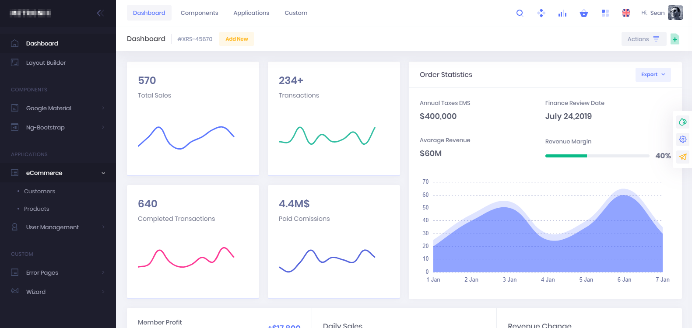
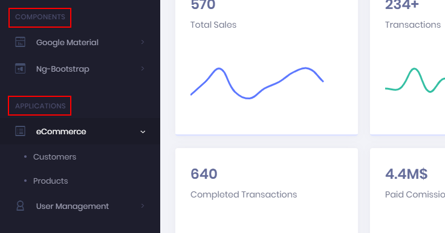
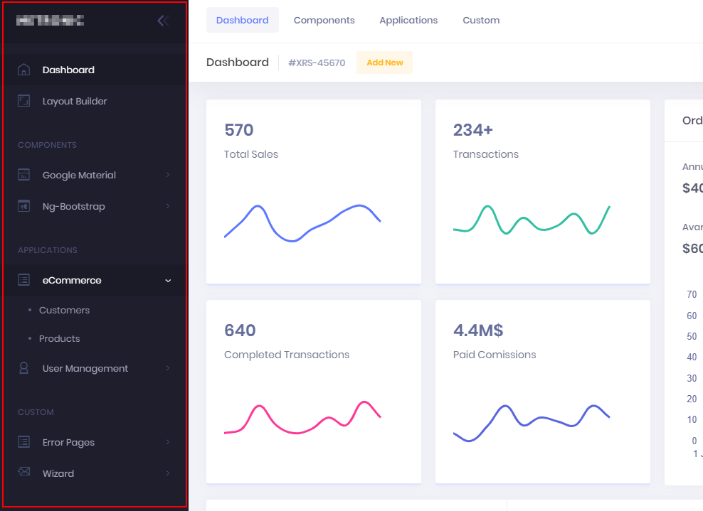
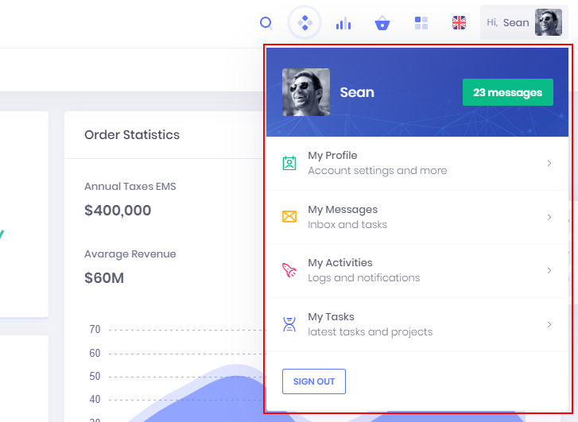

# Page
Pages are object that allows user to interact with Core. Pages are available only through websocket and user interface must be implemented by client.

```python
from core import *


class Welcome(Page):
    def _init(self):
        self._name = 'Welcome'
        self._caption = label('Welcome Page')

        if appctr := control.AppCenter(self):
            if actarea := control.ActionArea(appctr):
                if actcust := control.Action(actarea, label('Custom')):
                    if acterrs := control.Action(actcust, label('Error Pages'), 'fa-exclamation-triangle'):
                        self.error1 = control.Action(acterrs, label('Error 1'))
             
    def _error1_click(self):
        if Client.confirm('Continue?'):
            Client.message('Continue YES')        
        else:
            Client.message('BREAK')                
```

A page is made by multiple controls. Each control can contains other controls and so on.

When a control is added as member of the page, it's possible to define its specific method.

## AppCenter
Represents the main container of other controls with navigation pane, action area, user control, search...



## ActionArea
Is the area that contains actions. Rendering depends by the parent control.


## ActionGroup
Group one or more actions with a title.

Available properties:
* `caption`



## ActionList
Similar to `ActionArea` but arranges actions in a list way with additional description.


## Action
Represents an action clickable by user (menu item, button...)

Available properties:
* `caption`
* `icon`
* `descripton`

Actions can be nested to generate menu trees.


## Search
Available as `AppCenter` child, represents generic and free text search.


## NavigationPane
Available as `AppCenter` child, represents a menu navigation pane.



## UserCenter
Available as `AppCenter` child, represents the area dedicated to the logged in user with additional information, signout...



