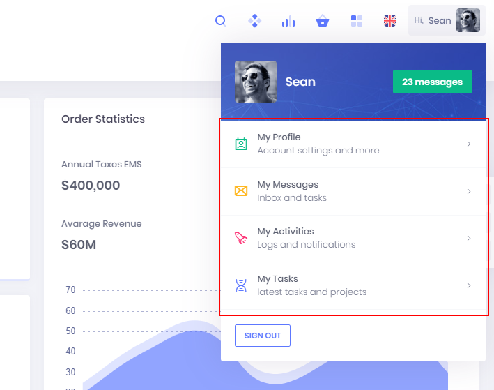
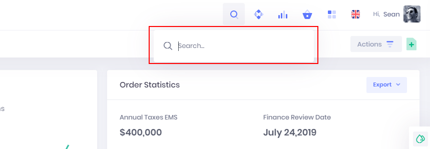
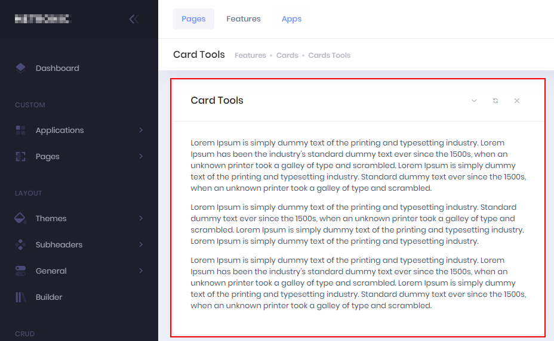
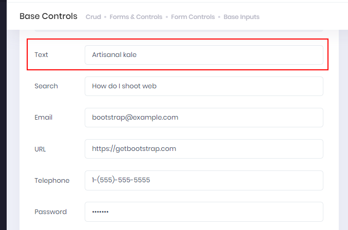

# Page
Pages are object that allows user to interact with Core. Pages are available only through websocket and user interface must be implemented by client.

```python
from core import *


class Welcome(Page):
    def _init(self):
        self._name = 'Welcome'
        self._caption = label('Welcome Page')

        if appctr := control.AppCenter(self):
            if actarea := control.ActionArea(appctr):
                if actcust := control.Action(actarea, label('Custom')):
                    if acterrs := control.Action(actcust, label('Error Pages'), 'fa-exclamation-triangle'):
                        self.error1 = control.Action(acterrs, label('Error 1'))
             
    def _error1_click(self):
        if Client.confirm('Continue?'):
            Client.message('Continue YES')        
        else:
            Client.message('BREAK')                
```

A page is made by multiple controls. Each control can contains other controls and so on.

When a control is added as member of the page, it's possible to define its specific method.

## Triggers
Following triggers are raised:

* `_onopen` before the page is shown

## Magic methods
* `_ctlinvoke(controlid, method, args)` invoke specified method in the control identified by ID passing arguments
* `_getdata(limit, sorting, filters)` returns data limited to specified rows, with sorting and filters applied
* `_selectrow(row)` select current row in the dataset

## AppCenter
Represents the main container of other controls with navigation pane, action area, user control, search...


Allowed childs:
* `ActionArea`
* `NavigationPane`
* `UserCenter`
* `Search`

## ActionArea
Is the area that contains actions. Rendering depends by the parent control.


Allowed childs:
* `Action`

## ActionGroup
Group one or more actions with a title.


Available properties:
* `caption`

Allowed childs:
* `Action`

## ActionList
Similar to `ActionArea` but arranges actions in a list way with additional description.



Allowed childs:
* `Action`

## Action
Represents an action clickable by user (menu item, button...)
Actions can be nested to generate menu trees.


Available properties:
* `caption`
* `icon`
* `descripton`

Available methods:
* `click`

Allowed childs:
* `Action`


## Search
Available as `AppCenter` child, represents generic and free text search.



Available methods:
* `search(what)`

## NavigationPane
Available as `AppCenter` child, represents a menu navigation pane.


Allowed childs:
* `ActionGroup`
* `Action`

## UserCenter
Available as `AppCenter` child, represents the area dedicated to the logged in user with additional information, signout...


Allowed childs:
* `ActionList`
* `Action`

## ContentArea
It's the root control of the child pages, normally rendered inside an `AppCenter`.


Allowed childs:
* `Repeater`
* `Group`
* `ActionArea`

## Group
Each page is organized with one or more collapsible group.



Allowed childs:
* `Field`

## Repeater
Represents a table of data.


Allowed childs:
* `Field`

## Field
It's the simplest control that accepts data input. It's rendered differently according to field data type.



Available methods:
* `validate(value, parsevalue)`
